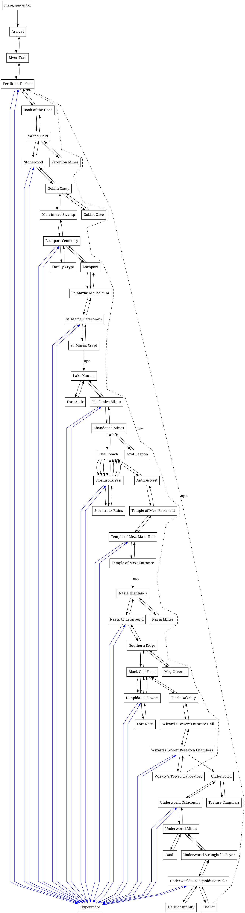

## About

`generate_graph` is a tool that generates the image shown below.
Or generally, it generates a graph of maps from a FLARE (game) mod.
It does so by traversing maps and extracting relevant "map connections".

It is kinda "untyped", relying on regular expressions, yet it works just fine
on the empyrean campaign (and probably others).



## Usage

```bash
./generate_graph.py --data_dir="/path/to/mod" | tee output.graphviz | dot -Tpng > output.png
```

Arguments in addition to `--data-dir` include:

- `--directional` - Force direction similar to game progression (Default = True)
- `--print_npc` - Print NPC map connections (Default = True)
- `--print_dead` - Print/draw unreachable map nodes (Default = False)
- `--graphviz_prefix` - Specify a Graphviz prefix file (Default = prefix.dot)
- `--graphviz_suffix` - Specify a Graphviz suffix file (Default = suffix.dot)

Also, you can replace "png" with "svg" or many other image formats;
see `dot` (graphviz) for documentation on that.

## Legacy

There are also two legacy bash scripts that generate map without sorting.
Unfortunately, the main smart algo does not differ much from it if you have crazy connected map tiles (hyperspace, I'm looking at you).
So if you don't care about sorting, you can use the much simpler bash scripts in this repo to generate graphviz file contents.
In this case, use:

```bash
./generate_graph.sh /path/to/mod/maps
```


## Prerequisites

Install "graphviz" package.


## License

GPLv3+
